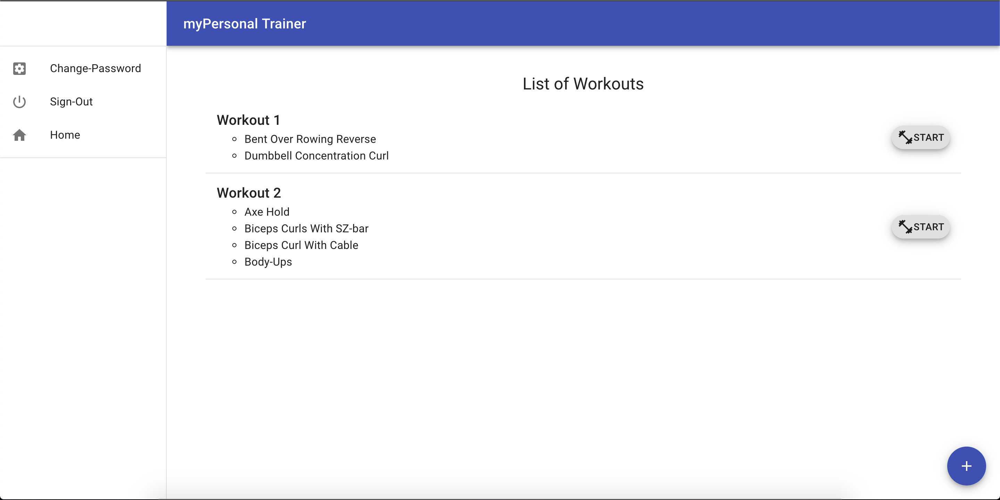

# myPersonal Trainer

This is the front end of myPersonal Trainer application which is an application to keep track of users workout routines. It's designed to let users create workouts and edit them adding or removing exercises. Users can create and edit workouts only by logging in the application.

### User Stories
- As a unregistered user, I would like to sign up with email and password.
- As a registered user, I would like to sign in with email and password.
- As a signed in user, I would like to change password.
- As a signed in user, I would like to sign out.
- As a unregistered user, I would like to create a new workout.
- As a unregistered user, I would like to edit exercises added to the workout.
- As a signed in user, I would to add or remove exercises from a workout.
- As a signed in user, I would to remove created workouts.

### Technologies Used
- JavaScript
- React.js
- JSX
- MongoDB & Mongoose
- Node.js
- Express.js
- Handlebars
- Axios

### The Process

Due to the fact that I had four days to make this project, I decided to set-up the back-end with all the basic routes for both of my resources. This gave me more time to learn and experiment with React y greater depth than what I actually expected. After add the structure for the front-end and some basic functionality, I decided to go back to the back-end to make my own custom routes to meet my requirements. I spent the last hours before the presentation adding my own touch to the styling and making sure everything worked flawlessly.

##### Stretch Goals:
1. Adding a 'Discover Workouts' route to show workouts created by other people.
2. Adding images and/or avatars.
3. Adding likes to other people workouts.
4. Adding the ability to clone another person workout.

##### Future Iterations
I want to add a timer that will help me rest between sets of every exercise in the workout.

##### Screenshot

#### Set-up
1. Download this template.
2. Unzip and rename the template directory
3. Move into the new project and git init.
4. Empty README.md and fill with your own content.
5. Replace myPersonal-Trainer-Client in package.json with your projects name.
6. Replace the "homepage" field in package.json with your (public) Github account name and repository name.
7. Install dependencies with npm install.
git add and git commit your changes.
8. Run the development server with npm start.

##### Sites and Images:

[Front-End Repository](https://github.com/kevinrosario/myPersonal-Trainer-Client)

[Front-end app](https://kevinrosario.github.io/myPersonal-Trainer-Client/)

[Back-End Repository](https://github.com/kevinrosario/myPersonal-Trainer-API)

[Back-end app](https://mypersonal-trainer.herokuapp.com/)

[Wireframe](https://imgur.com/p2kaWSt)
